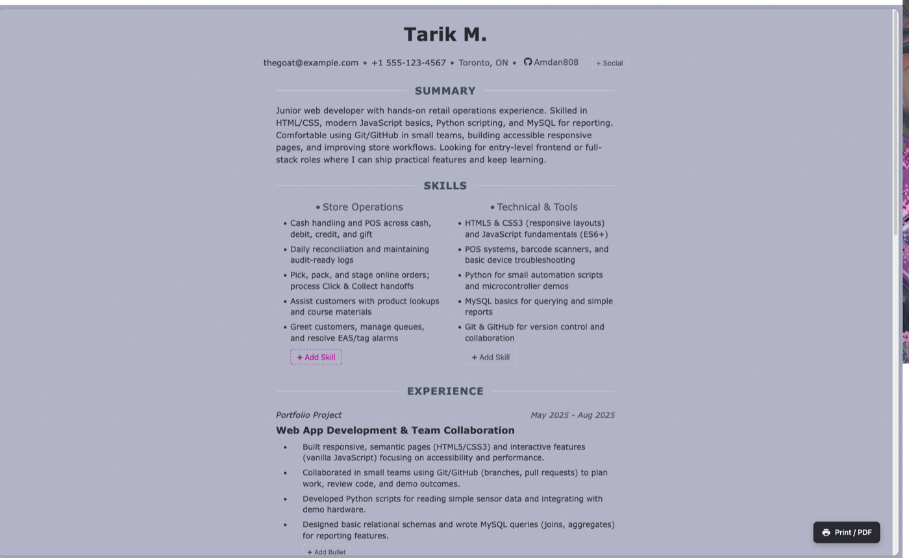
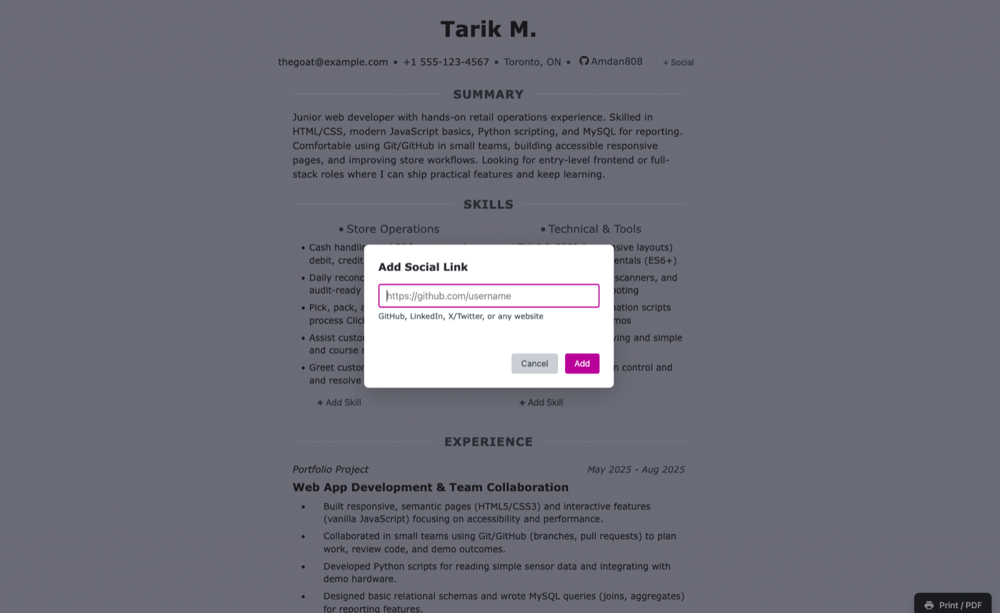
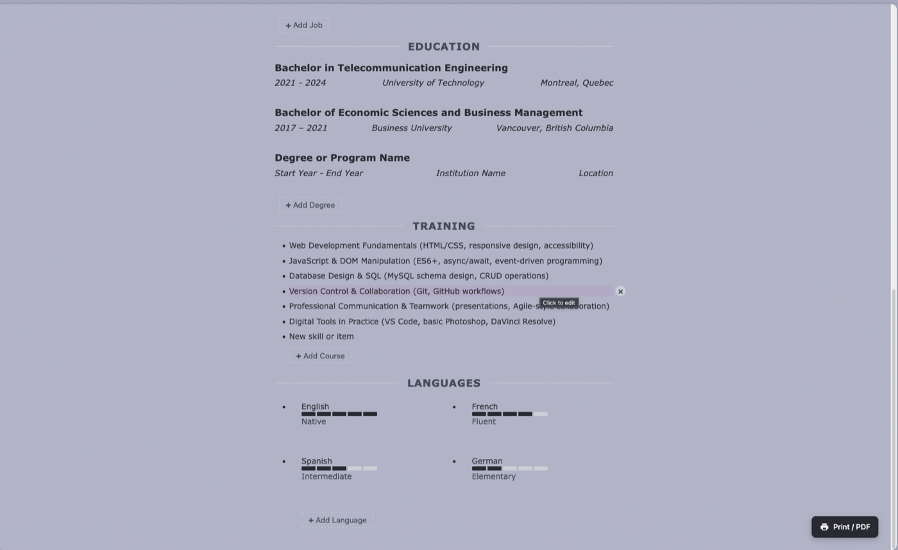
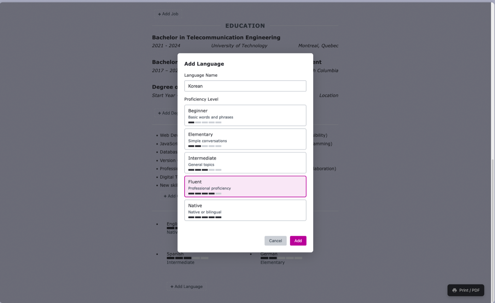
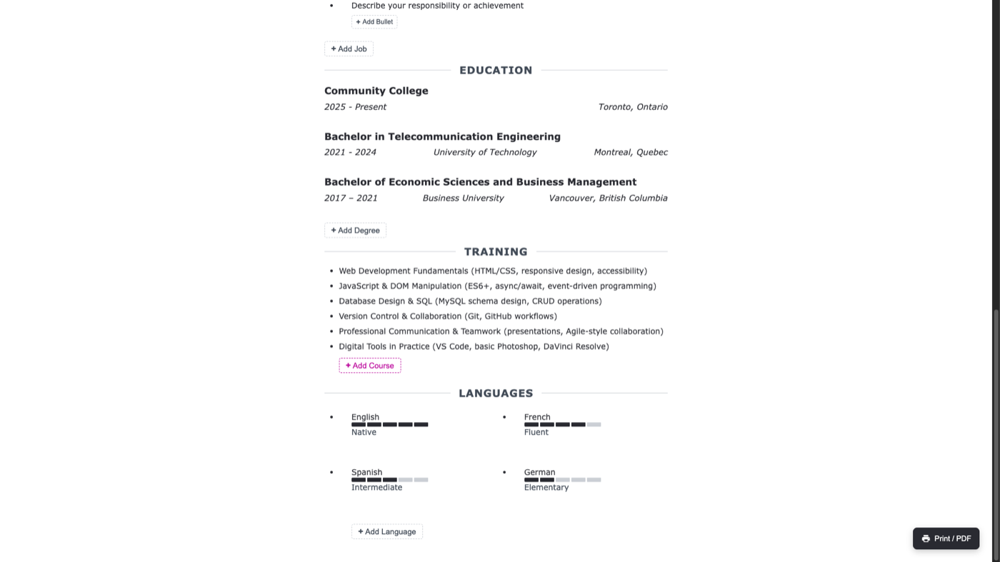
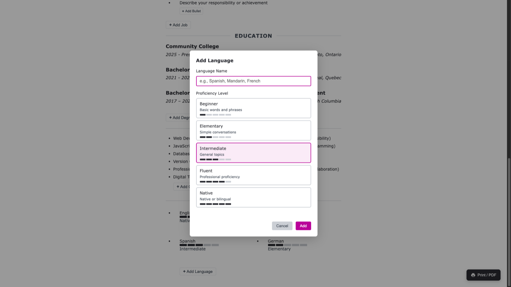
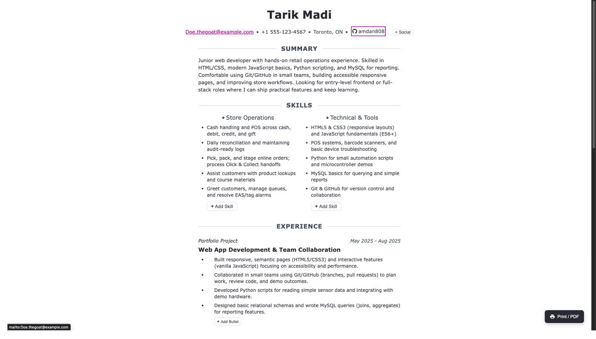
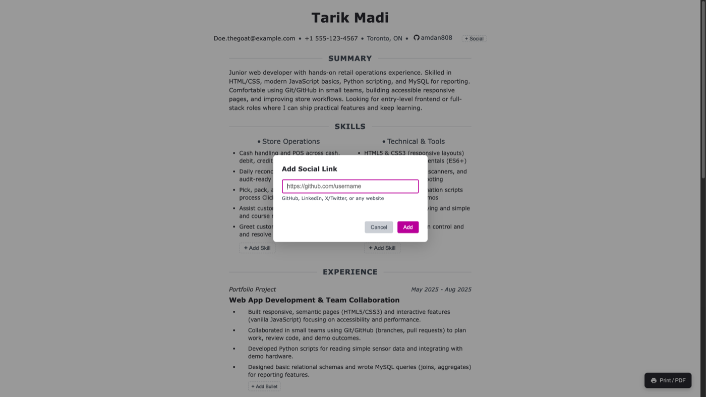

# Resume Builder

A clean, print-ready resume template with inline editing, built with plain HTML, CSS, and JavaScript. No frameworks, no build tools - just open `index.html` in a browser.

## Features

- Print-optimized: A4 layout with page breaks, orphan/widow control, and URL display for links
- Responsive: Mobile-friendly layout that adapts to screen size
- Accessible: Semantic HTML, skip link, and keyboard-friendly editing
- Inline editing: Click any field and edit in place
- List controls: Add/remove items for skills, experience, education, training, and languages
- Social links: Add profiles with platform detection and icons
- Local persistence: Edits auto-save in localStorage
- No dependencies: Pure HTML/CSS/JS, works offline

## Quick Start

1. Open `index.html` in your browser.
2. Click text to edit and type your changes; click outside to save.
3. Use the "+" buttons to add items or the remove button to delete items.
4. Click "Print / PDF" or press Ctrl/Cmd + P.

## Screenshots

<p>
  
  
</p>
<p>
  
  
</p>
<p>
  
  
</p>
<p>
  
  
</p>

## Editing Notes

- Single-line fields: Enter saves; Esc cancels any edit.
- Multiline fields: Use Shift+Enter or Ctrl+Enter to save, or click outside to save.
- Tab moves to the next editable field; Shift+Tab goes back.
- Language proficiency: Click the meter bar or label to change the level.
- Changes are saved in `localStorage` under `resume-builder:snapshot:v3`.
- If you edit `index.html` directly, clear that key to see the new base content.

## File Structure

```
resume-builder/
├── index.html          # Main resume document
├── assets/
│   └── screenshots/    # README images
├── css/
│   ├── style.css       # Screen styles and design tokens
│   └── print.css       # Print-specific optimizations
├── js/
│   └── script.js       # Inline editing and list controls
```

## Customization

### Design Tokens

Edit CSS custom properties in `css/style.css`:

```css
:root {
  --ink: #2e3038; /* Main text color */
  --muted: #4b5563; /* Secondary text */
  --rule: #d1d5db; /* Divider lines */
  --link: #c200a7; /* Link/accent color */
  --name: 2.25rem; /* Name font size */
  --sections: 1.225rem; /* Section heading size */
}
```

### Content

Edit `index.html` directly. Key sections:

- Header: Name and contact info
- Summary: Professional summary paragraph
- Skills: Two-column layout for skill categories
- Experience: Work history with dates
- Education: Degrees and institutions
- Training: Courses and certifications
- Languages: Proficiency meters

Elements with `data-editable` are editable in the browser.
Containers with `data-list` get add/remove controls.

### Print Settings

For best results when printing to PDF:

- Use Chrome or Edge for most consistent output
- Set margins to "Default" or "None" (the CSS handles margins)
- Enable "Background graphics" if you want meter bars to show
- Disable headers/footers for a cleaner look

## Browser Support

- Chrome (recommended for printing)
- Firefox
- Safari

## Development

Lint CSS with Stylelint:

```bash
npm install
npm run lint:css
npm run lint:css:fix  # Auto-fix issues
```

## License

ISC
